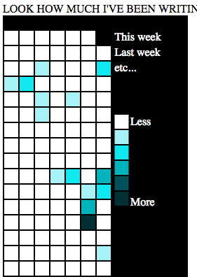

# Writing Log Graph Generator

Inspired by the way github shows your commit history on your profile. I wanted something that would show how much I've written each day in a visual way.

Generates an SVG heatmap graph based on the JSON object in writinglog.js

This may not be useful to anyone but me! If you do have a use for it, feel free to play with it! However, I threw this together in a couple hours and the code is... messy.

## Partial Screenshot

The resulting SVG is very tall, but here's part of the page generated

